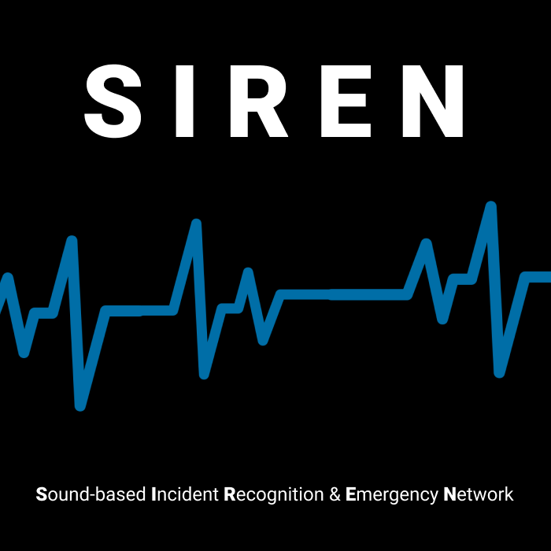

# Google Solution Challenge_siren

SIREN is a mobile application designed to protect vulnerable individuals from hidden and unpredictable threats by acting as a bridge to their guardians and helping establish a strong social safety net.

## 🏁 Getting Started

🔗 **Download the APK to try it out:**  
[siren.apk – Google Drive](https://drive.google.com/file/d/1unLYNk3WryVMKQUOJDZWLiC12OlKNlLK/view?usp=sharing)

## 🚀 Features

- **Log in with a Google account**  
  Easy access using an existing Google account

- **Keyword edit**  
  Personal keyword setting is available

- **Add friends**  
  Easily copy and paste the exclusive code to add friends

- **Real-time keyword voice detection and automatic recording**  
  Immediately starts recording when the keyword is detected

- **AI-powered risk situation assessment**  
  Analyzes both voice and text data for a more accurate evaluation

- **Sound & text context analysis using AI models**  
  Evaluates danger level through recording and text for better judgment

- **Automatic danger alert to friends (in-app contacts)**  
  Alerts include both the recording file and the user's location data

- **Speech-to-text transcription**  
  Transcribes recorded voice to assess danger level and send the situation to friends or the police

- **Secure storage of recorded audio**  
  Recordings can be used as legal evidence if needed

- **Location sharing during alerts**  
  Sends the user’s location in emergency alerts
